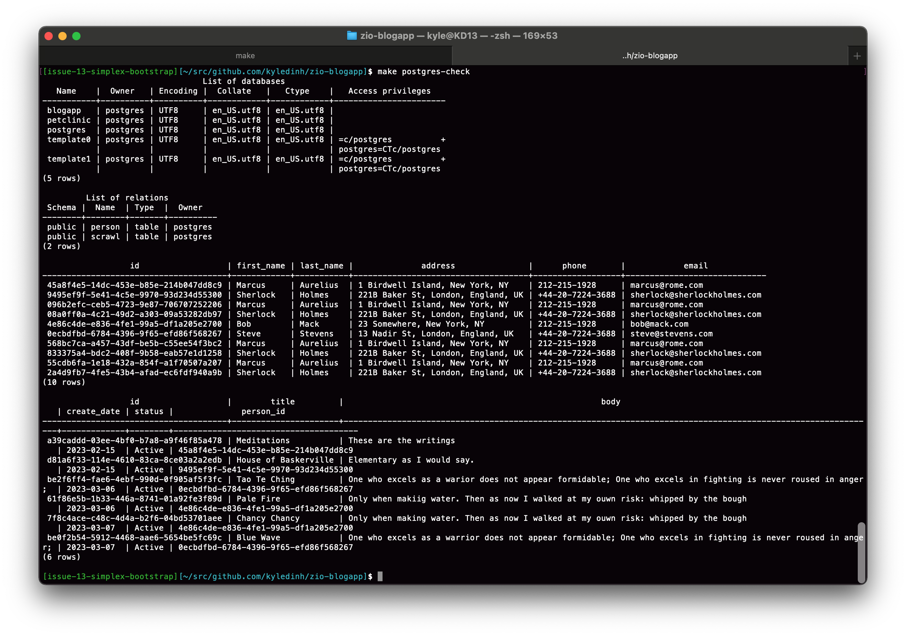

# ZIO Blog App
> A sample application written with ZIO 2, Scala 3 and ScalaJS/Laminar.

- Original repo: https://github.com/zio/zio-petclinic (Scala 2)
- Original video: https://www.youtube.com/watch?v=3lopiYfWmdQ (Awesome!)
- Then updated to Scala 3: https://github.com/kyledinh/zio-petclinic-scala-3 (blogapp branch) then used as template to create this Blog App

### Changes from the original repo with:

- [x] Update from Scala 2 to Scala 3.1.3
- [x] Docker for Postgres Database
- [x] Backend API for Blog App
- [x] Frontend with Scala.js/Laminar (Apply a different predesigned theme)
- [x] Use a standard Bootstrap 5 theme
- [ ] Update Tests
- [ ] Developer Tools/Guides 
- [x] Deploy with Kubernetes 
- [ ] CI pipeline
- [ ] Metrics


<br><hr><br>

## Table of Contents
- [About this project](#zio-blog-app)
- [Quick Guide to localdev](#quick-guide-to-localdev-with-docker)
- [Developer Guide](docs/guides/dev-guide.md)
    - [Onboarding Guide](docs/guides/onboarding-guide.md) | [Onboarding Video]()
    - [Backend Guide](docs/guides/backend-guide.md)
    - [Frontend Guide](docs/guides/frontend-guide.md)
    - [Troubleshooting Guide](docs/guides/troubleshooting-guide.md)
- [Architecture Guide](docs/guide/architecture-guide.md)
- [Markdown Guide](docs/guide/markdown-guide.md)


<br><hr><br>

## Software Versions 

| Software       | Version        | Install                                        |
|----------------|----------------|------------------------------------------------|
| JVM            | openjdk 17.0.4 | https://sdkman.io/install                      |
| Scala          | 3.2.2          | https://www.scala-lang.org/download            |
| sbt            | 1.8.2          | https://www.scala-sbt.org/download.html        |  
| Zio            | 2.0.2          | https://zio.dev/getting_started                |
| ScalaJS        | 1.13.1         | https://www.scala-js.org/                      |
| Laminar        | 15.0.1         | https://laminar.dev/                           |
| Postgres       | 14             | https://hub.docker.com/_/postgres              |
| Docker Desktop | 4.3.x          | https://www.docker.com/products/docker-desktop |

<br><hr><br>

## Quick Guide to localdev with Docker
> Requires Docker to be running  

### Setup

- `make check`
- `make setup`

Run the local database, start backend server in **Terminal 1**

Start the database
- `make postgres-up`
- `make postgres-init-migrate` (do this only on first time to seed the database)
- `make postgres-down` (to stop and remove the database container)

To run the backend API server (With sbt server)
- `make backend-compile`
- `make backend-up`

Run the frontend in a separate **Terminal 2**
- `make frontend-up`
- `make frontend-compile` (once up, just recompile and vite will reload the webpage)
- `open http://localhost:3000`

Check processes that are running
- `make status` (see that the SBT Server is running)
- `make check-postgres` (see what's in the database)

<br>

> Port number for services  

| Service  | Default Port | Environment Var      | Usage                                    |
|----------|--------------|----------------------|------------------------------------------|
| frontend | :3000        |                      | http://localhost:3000/                   |
| backend  | :4000        | BLOGAPP_BACKEND_PORT | http://localhost:4000/scrawls            |
| postgres | :5432        |                      | jdbc:postgresql://localhost:5432/blogapp |

<br><hr><br>

## Deploy to Kubernetes Cluster
> This project example will use the my Docker Hub public account at https://hub.docker.com/u/kyledinh
### Build the Docker images

- `make docker-build` - builds the backend and frontend images
- `make docker-push` - customize your DOCKER_HUB_REPO in Makefile to you account  
- View the [Docker Hub Repo](https://hub.docker.com/u/kyledinh)

### Setup for Kubernetes Local Stack
- `cd kubernetes` change directory to work with the `desktop-demo.sh` which is a safe script, designed to work ONLY with the desktop context in the demo namespace
- `./desktop-demo.sh init` will create the `demo` namespace
- `./desktop-demo.sh up` will create/update the deployments to the desktop Kubernetes Cluster
- `./desktop-demo.sh init-db` will perform the initial database migration to the postgres container

### Command to View/Edit the Kubernetes Stack
- `./desktop-demo.sh info` will get you info on the environment and all deployed service, pods, config maps, etc...
- `./desktop-demo.sh log <search-pattern>` will find the pod by search pattern and print the log
- `./desktop-demo.sh ex <search-pattern>` will start a bash session for a pod that matches the search pattern


<br><hr><br>

### Check the Postgres DB in the Docker container

- use: `make postgres-check`



<br><hr><br>

## Screenshots 
> using the Simplex Bootstrap Theme:

[![Board Page Screenshot][board-page-screenshot]](./docs/assets/blogapp-board-screenshot.png)
[![People Page Screenshot][people-page-screenshot]](./docs/assets/blogapp-people-screenshot.png)
[![Person Page Screenshot][person-page-screenshot]](./docs/assets/blogapp-person-screenshot.png)

Or you can view screenshots with the custom Medio CSS theme, this version is preserved in the ["medio"](https://github.com/kyledinh/zio-blogapp/tree/medio) branch:
- [Board Page Screenshot](./docs/assets/medio/blogapp-board-screenshot.png)
- [People Page Screenshot](./docs/assets/medio/blogapp-people-screenshot.png)
- [Medio Page Screenshot](./docs/assets/medio/blogapp-medio-screenshot.png)

[![Medio Page Screenshot][medio-page-screenshot]](./docs/assets/blogapp-medio-screenshot.png)

<br><hr><br>

## Project Outline 

A good starting point to understand this repo is with the `Makefile`. It will have the most common commands to check, setup, compile and build the project.

```
.
├── LICENSE
├── Makefile                   Commands to build/develop this project 
├── README.md
├── backend                    Scala code for RESTful api 
│   └── src
│       ├── main
│       └── test
│
├── build.sbt                  Dependency manager 
├── docker                     Scripts to build Docker images 
├── docker_pg_vol              Docker volume for Postgres DB
├── frontend                   Scala code that generates `main.js` for the webserver
│   ├── src
│   │   └── main
│   └── target
│       └── scala-3.1.3        main.js will be generated here
│
├── js-frontend                Javasript webserver using vite/Node
│   ├── index.html
│   ├── main.js
│   ├── main.scss
│   ├── medio/                 CSS/JS UI Template folder, "Medio" custom theme
│   ├── node_modules/
│   ├── package.json
│   ├── postcss.config.js
│   ├── simplex/               CSS/JS UI Template folder, "Simplex" Bootstrap theme
│   ├── tailwind.config.js
│   ├── vite.config.js
│   └── yarn.lock
│
├── kubernetes                 Files to deploy to Kube Cluster (locally) 
├── project                    The only project directory to be concerned with
│   ├── build.properties       sbt version  
│   └── plugins.sbt            plugins
│
├── sem-version                x.x.x
└── shared                     Scala code shared by backend and frontend, models 
    └── src
        ├── main
        └── test
```

## Response HTML Tempate 
- Medio - from [Untree.co](https://untree.co/free-templates/medio-web-design-agency-template-free-download/)

<!-- MARKDOWN LINKS & IMAGES -->
<!-- https://www.markdownguide.org/basic-syntax/#reference-style-links -->
[product-screenshot]: js-frontend/zio-pet-clinic-webpage.png
[board-page-screenshot]: docs/assets/simplex/blogapp-board-screenshot.png
[people-page-screenshot]: docs/assets/simplex/blogapp-people-screenshot.png
[person-page-screenshot]: docs/assets/simplex/blogapp-person-screenshot.png
[medio-page-screenshot]: docs/assets/medio/blogapp-medio-screenshot.png